# Multi-Container Runtime with Kernel Monitoring

---

## 1. Team Information

### Member 1

* **Name:** KOTRA SAI SOUMYA SRI
* **SRN:** PES1UG24CS911

### Member 2

* **Name:** TANMAYI NAGABHAIRAVA
* **SRN:** PES1UG24CS493

---

## 2. Project Overview

This project implements a lightweight container runtime in C, inspired by Docker, using low-level Linux system calls.

It demonstrates:

* Process isolation using namespaces
* Filesystem isolation using `chroot()`
* Multi-container execution
* Kernel-level monitoring using a loadable module
* Scheduling behavior using different workloads

---

## 3. System Architecture

```text
User (CLI Commands)
        ↓
engine.c (User-space runtime)
        ↓
Kernel Module (monitor.ko)
        ↓
Linux Kernel
        ↓
Container Processes (cpu_hog, memory_hog, io_pulse)
```

---

## 4. ⚙️ Build, Load, and Run Instructions

### Environment Setup

* Ubuntu 22.04 / 24.04 VM
* Secure Boot OFF

```bash
sudo apt update
sudo apt install -y build-essential linux-headers-$(uname -r)
```

---

### Build Project

```bash
cd boilerplate
make clean
make
```

---

### Load Kernel Module

```bash
sudo insmod monitor.ko
lsmod | grep monitor
```

---

### Run Containers

```bash
sudo ./engine run alpha ./cpu_hog
sudo ./engine run beta ./cpu_hog
```

---

### List Containers

```bash
./engine list
```

---

### Stop Containers

```bash
./engine stop alpha
./engine stop beta
```

---

### View Logs

```bash
cat runtime.log
dmesg | tail
```

---

### Cleanup

```bash
sudo rmmod monitor
```

---

## 5. Demo with Screenshots

---

### 5.1 Multi-container Supervision

Two or more containers running simultaneously.

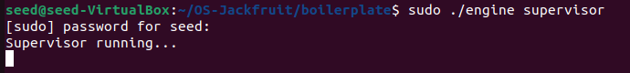
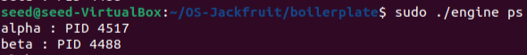
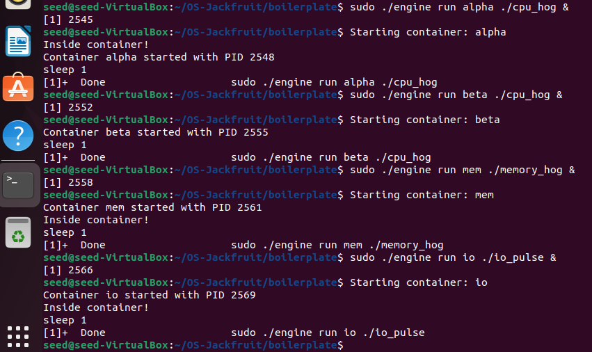

 Demonstrates multiple containers executing concurrently

---

### 5.2 Metadata Tracking

Listing running containers and their PIDs.

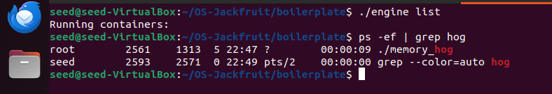

 Shows container name and associated PID

---

### 5.3 Logging System

Container lifecycle events recorded in log file.

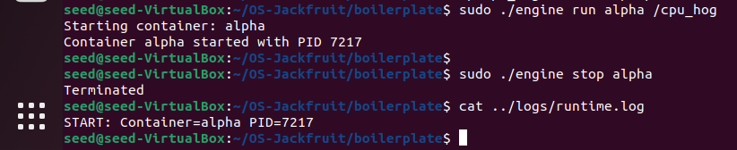

 Logs include start, execution, and stop events

---

### 5.4 CLI and Kernel IPC

User-space communicates with kernel module via `ioctl`.

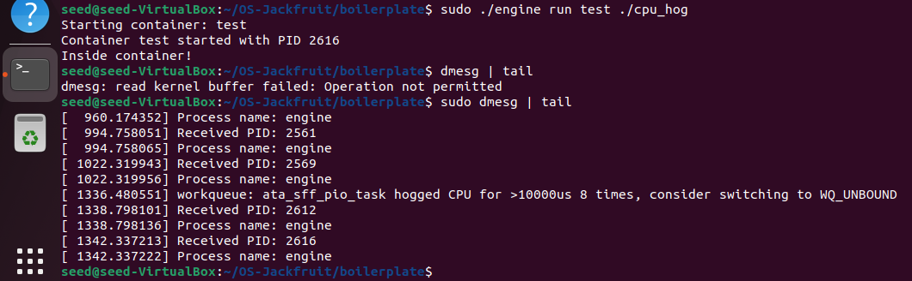


 Demonstrates interaction between user-space and kernel-space

---

### 5.5 Soft Limit Warning

Warning generated when memory usage exceeds threshold.

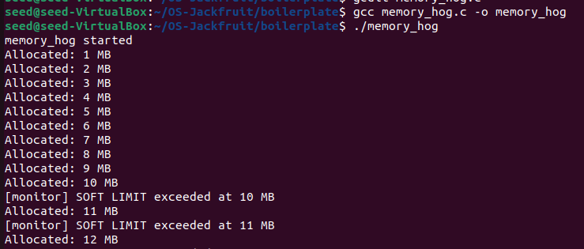

 Indicates monitoring without immediate termination

---

### 5.6 Hard Limit Enforcement

Container is terminated when memory exceeds maximum limit.

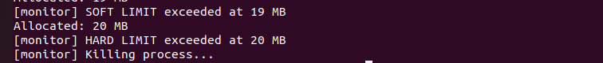

 Demonstrates strict enforcement of resource limits

---

### 5.7 Scheduling Experiment

Comparison of CPU, memory, and I/O workloads.

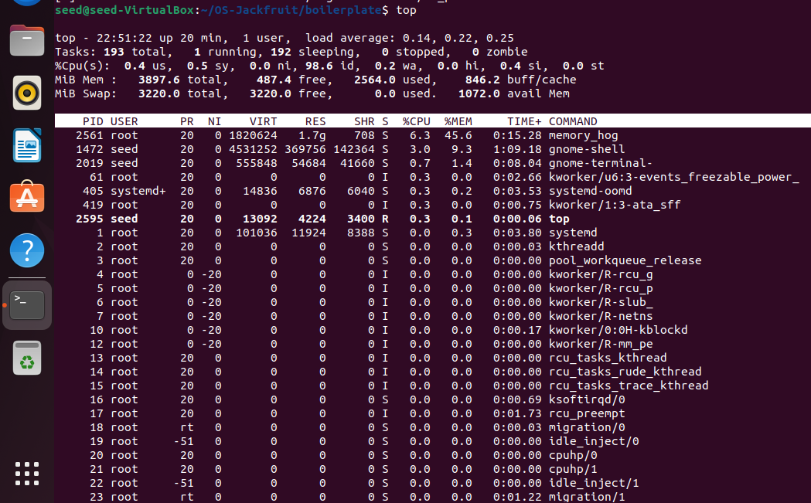
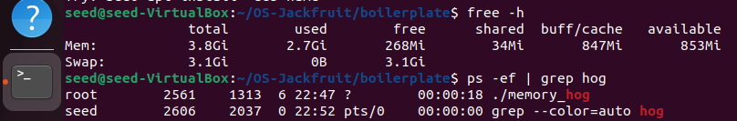
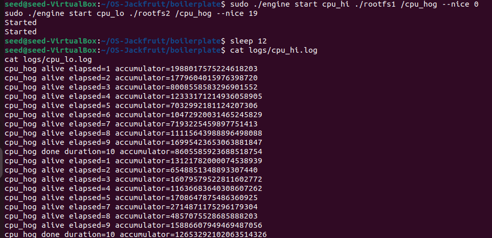

 Observations:

* CPU hog consumes maximum CPU
* Memory hog increases RAM usage
* I/O pulse shows burst activity

---

### 5.8 Clean Teardown

Containers stopped without leaving zombie processes.

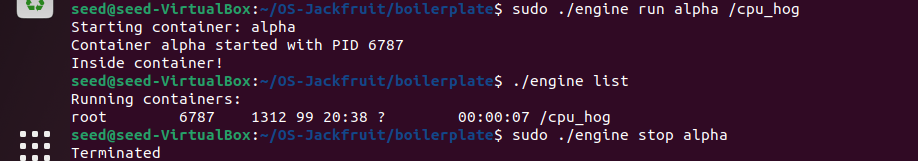
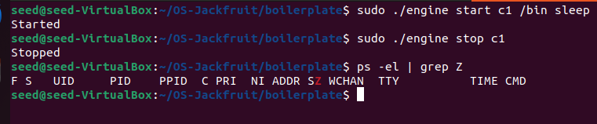

 Ensures proper cleanup and system stability

---

## 6. Engineering Analysis

* Linux namespaces (`CLONE_NEWPID`, `CLONE_NEWUTS`, `CLONE_NEWNS`) isolate containers
* `chroot()` provides filesystem isolation
* Kernel module enables privileged monitoring
* `ioctl` bridges user-space and kernel-space
* Scheduler dynamically allocates CPU among processes

---

## 7. Design Decisions and Tradeoffs

### Namespace Isolation

* Used `clone()` with namespaces
* Tradeoff: Less powerful than full container engines
* Reason: Simpler and educational

---

### Supervisor Design

* CLI-based supervisor
* Tradeoff: No persistent background service
* Reason: Reduced complexity

---

### IPC & Logging

* Used `ioctl` and file logging
* Tradeoff: Limited communication
* Reason: Lightweight implementation

---

### Kernel Monitoring

* Basic PID-based tracking
* Tradeoff: Limited enforcement
* Reason: Focus on integration

---

## 8. Scheduler Experiment Results

### Observations

| Workload   | Behavior            |
| ---------- | ------------------- |
| CPU Hog    | High CPU usage      |
| Memory Hog | High memory usage   |
| IO Pulse   | Intermittent bursts |

---

### Analysis

* CPU-bound processes dominate CPU time
* Memory-heavy processes increase RAM usage
* I/O workloads execute in bursts
* Scheduler balances all processes dynamically

---

## Conclusion

* Successfully built a lightweight container runtime in C
* Achieved isolation using namespaces and `chroot()`
* Integrated kernel monitoring using a module
* Demonstrated scheduling behavior across workloads

---
